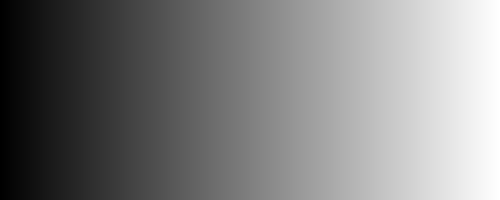
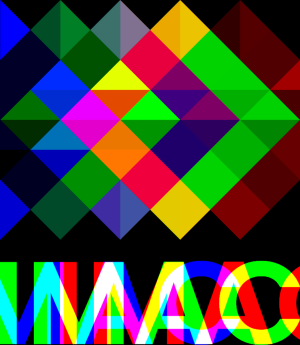
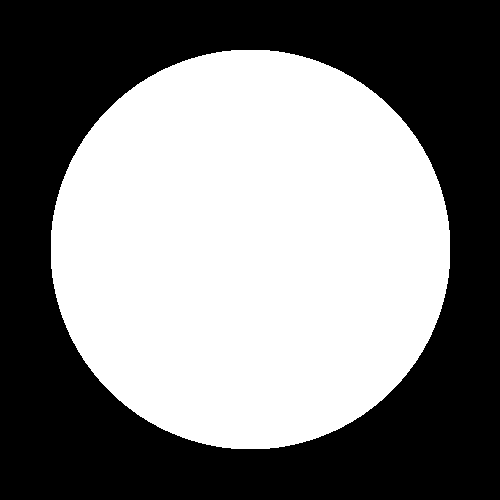
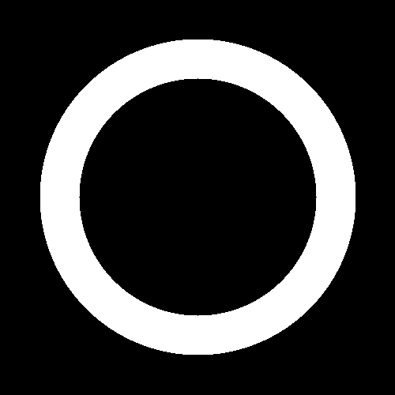
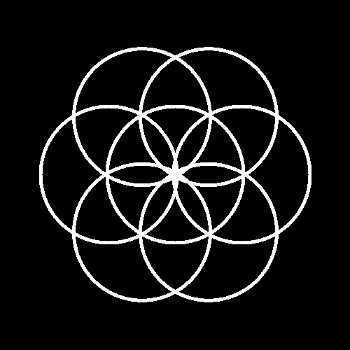
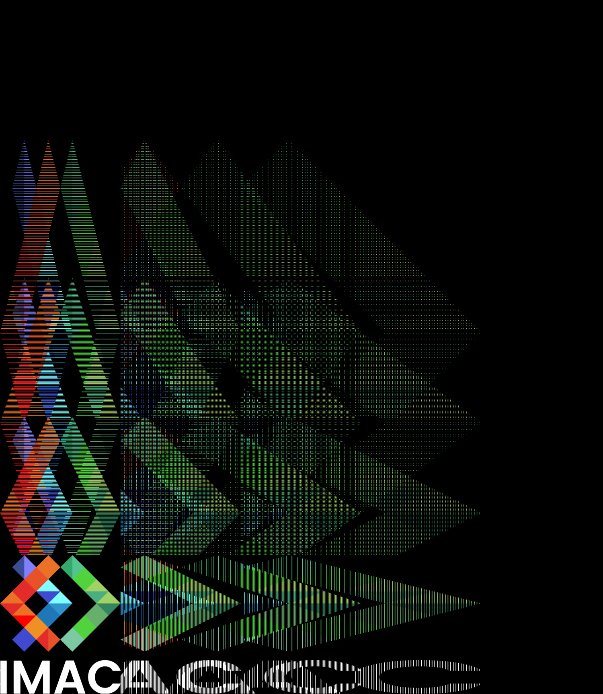
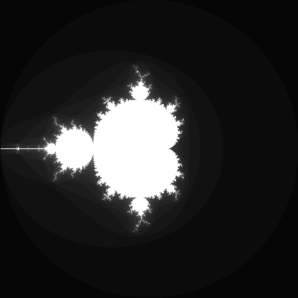

# S1 | Prog: Workshop c++
## Beaujault Sarah & Jan Agathe

---

### Exercice 01 : Ne garder que le vert
 

---
### Exercice 02 : Échanger les canaux
 

---
### Exercice 03 : Noir et blanc
 

---

### Exercice 04 : Négatif
 

---
### Exercice 05 : Dégradé
**Fonctionnement**
On part d'une image totalement noire, puis on éclaircit chaque pixel en fonction de leurs colonnes.


---

### Exercice 06 : Miroir
**Fonctionnement**
On prend une copie de l'image, puis on repositionne chaque pixel sur cette copie de sorte à inverser l'image. Pour cela, on modifie la position de x avec la formule suivante : `image2.width() - 1.f - x`

 

**Problème rencontré**
Au tout départ, je n'avais pas effectué de copie de l'image et modifiait directement l'image d'origine, ce qui avait pour effet de n'inverser qu'une moitié de l'image.

---
### Exercice 07 : Image Bruité
####Version de Sarah 
**Fonctionnement**
Pour chaque pixel qui compose l'image, on détermine aléatoirement si ce pixel est bruité ou non. Si oui on l'associe à une couleur choisie elle aussi aléatoirement.

 

**Problème rencontré**

Dans la première version du code, je déterminais si un pixel était bruité ou non avec cette partie du code : 
`int isPixelBruit {random_int(0, 4)};
if (isPixelBruit = 1)`
Cependant, avec cette formule il est impossible de choisir une fréquence de bruit telle que 1/28 par exemple. 
Le code final contient ces ligne qui permettent de pouvoir choisir avec beaucoup plus de précision le taux de bruit sur l'image finale 
`float rand{random_float(0.f, 1.f)};
        if (rand < 0.28f)`


####Version d'Agathe
**Fonctionnement**
On choisit le nombre de bruit que l'on veut créer et l'on effectue une boucle pour rajouter chaque point du bruit un par un. Au sein de la boucle, on choisit un pixel au hasard et on attribue une couleur au hasard à chacune des composantes (verte, bleue et jaune) avec un `random_float(0,1)`

 

---
### Exercice 08 : RGB Split 
**Fonctionnement**
La fonction crée une copie de l'image d'origine, puis sépare les composantes rouges, bleues et vertes de l'image d'origine pour les placer respectivement du côté droit, gauche et au centre de l'image copiée. L'espacement entre les couleurs est choisit en argument.

 

**Remarque**

Si chaque couleur est espacé de 1/5 de la taille de l'image d'origine alors le résultat ressemble à un effet arlequin 




---
### Exercice 09 : Luminosité 

La fonction ajuste la luminosité de chaque pixel en élevant chaque composante de couleur à la puissance 0.6. Cela a pour effet de réduire l'intensité lumineuse globale de l'image.

 
---
### Exercice 10 : Disque 

---
### Exercice 11 : Cercle 

---
### Exercice 12 : Rosace 
**Fonctionnement**

Les coordonnées du centre et le rayon du cercle central sont définis, puis une boucle génère les coordonnées des cercles périphériques en fonction du nombre de cercles spécifié (nb_circles). Ces coordonnées sont calculées en utilisant les fonctions trigonométriques cos et sin pour répartir les cercles uniformément autour du cercle central. Chaque cercle est ensuite dessiné à l'aide de la fonction dessineCercle.



### Exercice 13 : Mosaïque
**Fonctionnement**
On crée d'abord une image 5 fois plus grande que l'image d'origine, puis on parcourt chaque pixel de cette nouvelle image. Dès que l'on a copié un logo en entier, on en copie un deuxième à côté et ainsi de suite jusqu'à ce que l'image soit entièrement remplis. Pour ce faire, on utilise une double boucle :
```cpp
for (int i{0}; i < 5; ++i)
            {
            for (int j{0}; j < 5; ++j)
                {
                    image2.pixel(x+i*image.width(), y+j*image.height()) = image.pixel(x, y);
                }
            }
```

 

**Problème rencontré**
Lors de ma première version de la fonction, j'ai utilisé une formule qui ne prenait pas en compte tout les pixels de l'image et donc ne copiait pas tout les pixels correctement :
```cpp
for (int i{0}; i < 5; ++i)
            {
                for(int j{0}; j < 5; ++j)
                {
                    logo2.pixel(x*i, y*j) = logo.pixel(x, y);
                }
            }
```



### Exercice 14 : Mosaïque miroir
**Fonctionnement**
Comme pour la mosaïque, on crée d'abord une image 5 fois plus grande que l'image d'origine, puis on parcourt chaque pixel de cette nouvelle image. On établi deux variables : `int NewX {x%image.width()}` et `int NewY {y%image.height()}` qui nous permettent de revenir au début du logo dès que l'on a finit de le copier. Enfin, une fois sur deux, on modifie ces variables pour qu'elles recopient le logo à l'envers : `NewX = {image.width() - 1 - NewX}` et `NewY = {image.height() - 1 - NewY}`

 

### Exercice 15 : Glitch 
**Fonctionnement**

La fonction crée une version glitchée d'une image en remplaçant des portions aléatoires de l'image par des segments provenant d'autres parties de l'image. Le nombre de glitchs et les paramètres spécifiques de chaque glitch (position, longueur, largeur) sont déterminés de manière aléatoire.

 

---
### Exercice 16 : Fractale 


**Problème rencontré**

La première fois que j'ai essayé de faire tourner le programme je n'ai pas réussie car j'ai oublié de mettre le `static_cast<float>`

---
### Exercice 17 : Tramage
**Fonctionnement**
On prend une image que l'on passe en noir et blanc, puis on initialise une matrice de Bayer.
```cpp
float bayer_matrix_4x4[][bayer_n] = { 
        { -0.5, 0, -0.375, 0.125 }, 
        { 0.25, -0.25, 0.375, - 0.125 }, 
        { -0.3125, 0.1875, -0.4375, 0.0625 }, 
        { 0.4375, -0.625 , 0.3125, -0.1875 } };
```
On calcule ensuite la couleur de sortie des pixels en fonction de leurs couleurs d'origine et des valeurs de la matrice :
```cpp
float orig_color = image.pixel(x, y).r;
float bayer_value = bayer_matrix_4x4[y % bayer_n][x % bayer_n]; 
float output_color = orig_color + (1 * bayer_value);
```
Enfin, si la couleur de sortie est inférieur à 0.5, le pixel deviendra noir, sinon il deviendra blanc.

 

---
### Exercice 18 : Vortex
  

**Problème rencontré**

Dans ma première version du programme, j'ai attribué les pixels de l'image d'origine aux pixels de l'image final avec pour coordonné les points après rotation. Or en faisant cette méthode nous nous retrouvons avec certains pixels noirs alors qu'ils devraient être colorés, cela est dû au fait qu'après rotation, certains pixels se retrouvent entre deux pixels de l'image d'origine.
`imageVortex.pixel(nouveau_point.x, nouveau_point.y) = image.pixel(x,y);`
Résultat :


Il faut donc attribuer aux pixels de l'image final, la couleur des pixels d'origine après rotation
`imageVortex.pixel(x,y) = image.pixel(nouveau_point.x, nouveau_point.y);`

---
### Exercice 19 : Normalisation de l'Histogramme

 

**Problème rencontré**

Ma première version du programme se trouvait être fausse car je m'étais trompé dans la formule à utiliser, cependant l'image enregistrée avait bien une plus grande profondeur de couleur. 
Formule utilisé :
`color = color * (1/hight_brightness) - low_brightness;`
Résultat :


---
### Exercice 20 : Convolution
**Fonctionnement**
On parcourt chaque pixel de l'image avec un kernel, et on effectue la moyenne de ce pixel et de ceux qui l'entourent, puis on modifie la couleur du pixel par cette moyenne. Si un pixel est un bord de l'image, alors il sera automatiquement noir.

 

**Remarque**
Le flou ici est très léger mais pourrait être augmenté avec un plus gros kernel.

---

### Exercice 21 : Emboss
**Fonctionnement**
Même principe que la convolution, mais avec des coefficients différents dans la matrice.
```cpp
float kernel[3][3] = {{ -2.f, -1.f, 0.f }, 
                      { -1.f, 1.f, 1.f }, 
                      { 0.f, 1.f, 2.f }};
```

 

### Exercice 22 : Outline
**Fonctionnement**
Même principe que la convolution, mais avec des coefficients différents dans la matrice.
```cpp
float kernel[3][3] = {{ -1.f, -1.f, -1.f }, 
                      { -1.f, 8.f, -1.f }, 
                      { -1.f, -1.f, -1.f }};
```

 

### Exercice 23 : Sharpen
**Fonctionnement**
Même principe que la convolution, mais avec des coefficients différents dans la matrice.
```cpp
float kernel[3][3] = {{ 0.f, -1.f, 0.f }, 
                      { -1.f, 5.f, -1.f }, 
                      { 0.f, -1.f, 0.f }};
```

 


